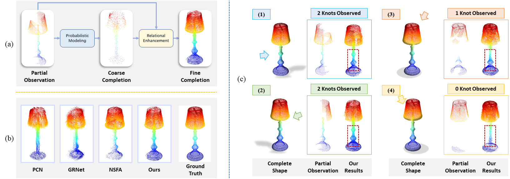
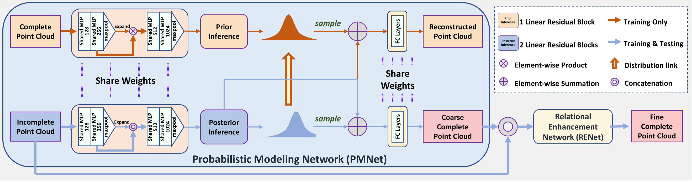
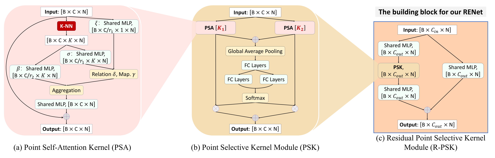
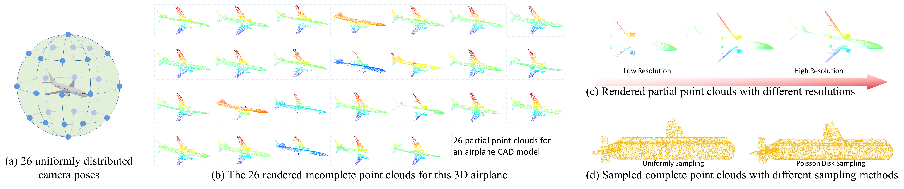

# *VRCNet:* Variational Relational Point Completion Network
<p align="center"> 

</p>


## [NEWS]
- **2021-07-12 [NEW:tada:]** The submission on [Codalab](https://competitions.codalab.org/competitions/33430) starts!
- **2021-07-10 [NEW:tada:]** [Database Website](https://mvp-dataset.github.io) and [Challenge Website](https://competitions.codalab.org/competitions/33430) are online!
- **2021-07-09 [NEW:tada:]** [MVP Benchmark Codebase](https://github.com/paul007pl/MVP_Benchmark) are released!
- **2021-07-01** The MVP challenges will be hosted in the **ICCV2021 Workshop**: ***[Sensing, Understanding and Synthesizing Humans](https://sense-human.github.io/)***.


## [VRCNet]
This repository contains the PyTorch implementation of the paper:

**Variational Relational Point Completion Network, CVPR 2021 (Oral)**

[[arxiv](https://arxiv.org/abs/2104.10154)|[results](https://www.youtube.com/watch?v=0SNHlxvCP0g)|[presentation](https://www.youtube.com/watch?v=8qyhsyis9JY)|[webpage](https://paul007pl.github.io/projects/VRCNet)|[pretrianed](https://www.dropbox.com/sh/8uixt8dbqfoh1bn/AADbmET-i73hzMEvsYVYhT_Za?dl=0)]


In CVPR 2021

> Real-scanned point clouds are often incomplete due to viewpoint, occlusion, and noise. Existing point cloud completion methods tend to generate global shape skeletons and hence lack fine local details. Furthermore, they mostly learn a deterministic partial-to-complete mapping, but overlook structural relations in man-made objects. To tackle these challenges, this paper proposes a variational framework, **V**ariational **R**elational point **C**ompletion network (VRCNet) with two appealing properties: **1) Probabilistic Modeling.** In particular, we propose a dual-path architecture to enable principled probabilistic modeling across partial and complete clouds. One path consumes complete point clouds for reconstruction by learning a point VAE. The other path generates complete shapes for partial point clouds, whose embedded distribution is guided by distribution obtained from the reconstruction path during training. **2) Relational Enhancement.** Specifically, we carefully design point selfattention kernel and point selective kernel module to exploit relational point features, which refines local shape details conditioned on the coarse completion. In addition, we contribute **a multi-view partial point cloud dataset (MVP dataset)** containing over 100,000 high-quality scans, which renders partial 3D shapes from 26 uniformly distributed camera poses for each 3D CAD model. Extensive experiments demonstrate that VRCNet outperforms state-of-theart methods on all standard point cloud completion benchmarks. Notably, VRCNet shows great generalizability and robustness on real-world point cloud scans.


VRCNet architecture overview:
<p align="center"> 

</p>


Our proposed point cloud learning modules:
<p align="center"> 

</p>


### Installation
Moreover, this repository introduces an integrated Point Cloud Completion Benchmark implemented in Python 3.5, PyTorch 1.2 and CUDA 10.0. 
Supported algorithms: PCN, Topnet, MSN, Cascade, ECG and our VRCNet.

**You can also try the new [implementation](https://github.com/paul007pl/MVP_Benchmark), which supports Python 3.7, Pytorch 1.5.0 and CUDA 10.1**

1. Install dependencies:
+ h5py 2.10.0
+ matplotlib 3.0.3
+ munch 2.5.0
+ open3d 0.9.0
+ PyTorch 1.2.0
+ PyYAML 5.3.1

2. Download corresponding dataset (e.g. [MVP dataset](https://www.dropbox.com/sh/la0kwlqx4n2s5e3/AACjoTzt-_vlX6OF9mfSpFMra?dl=0&lst=))

3. Compile PyTorch 3rd-party modules ([ChamferDistancePytorch](https://github.com/ThibaultGROUEIX/ChamferDistancePytorch), [emd, expansion_penalty, MDS](https://github.com/Colin97/MSN-Point-Cloud-Completion), [Pointnet2.PyTorch](https://github.com/sshaoshuai/Pointnet2.PyTorch))


### MVP Dataset
Please download our MVP Dataset ([Dropbox](https://www.dropbox.com/sh/la0kwlqx4n2s5e3/AACjoTzt-_vlX6OF9mfSpFMra?dl=0&lst=) or [Google Drive](https://drive.google.com/drive/folders/1ylC-dYFM45KW4K9tPyljBSVyetazCEeH?usp=sharing)) to the folder `data`.
<p align="center"> 

</p>


### Usage
+ To train a model: run `python train.py -c *.yaml`, e.g. `python train.py -c pcn.yaml`
+ To test a model: run `python test.py -c *.yaml`, e.g. `python test.py -c pcn.yaml`
+ Config for each algorithm can be found in `cfgs/`.
+ `run_train.sh` and `run_test.sh` are provided for SLURM users. 


## [Citation]
If you find our code useful, please cite our paper:
```bibtex
@article{pan2021variational,
  title={Variational Relational Point Completion Network},
  author={Pan, Liang and Chen, Xinyi and Cai, Zhongang and Zhang, Junzhe and Zhao, Haiyu and Yi, Shuai and Liu, Ziwei},
  journal={arXiv preprint arXiv:2104.10154},
  year={2021}
}
```


## [License]
Our code is released under MIT License.


## [Acknowledgement]
We include the following PyTorch 3rd-party libraries:  
[1] [ChamferDistancePytorch](https://github.com/ThibaultGROUEIX/ChamferDistancePytorch)  
[2] [emd, expansion_penalty, MDS](https://github.com/Colin97/MSN-Point-Cloud-Completion)  
[3] [Pointnet2.PyTorch](https://github.com/sshaoshuai/Pointnet2.PyTorch)  

We include the following algorithms:  
[1] [PCN](https://github.com/wentaoyuan/pcn)  
[2] [MSN](https://github.com/Colin97/MSN-Point-Cloud-Completion)  
[3] [Topnet](https://github.com/lynetcha/completion3d)  
[4] [Cascade](https://github.com/xiaogangw/cascaded-point-completion)  
[5] [ECG](https://github.com/paul007pl/ECG)  
[6] [VRCNet](https://github.com/paul007pl/VRCNet)

